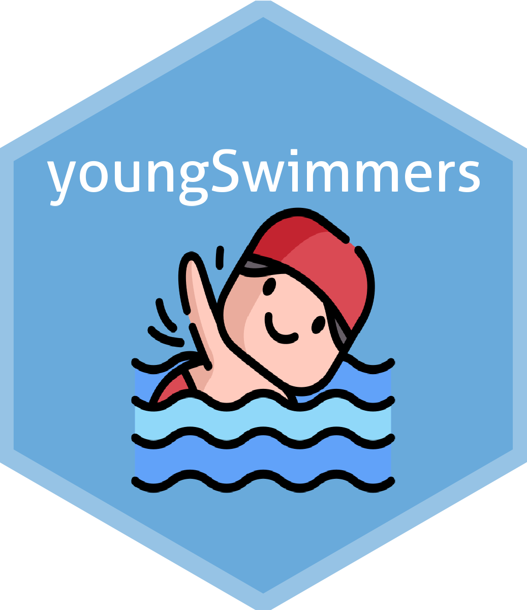

<!-- README.md is generated from README.Rmd. Please edit that file -->

```{r, include = FALSE}
knitr::opts_chunk$set(
  collapse = TRUE,
  comment = "#>",
  fig.path = "man/figures/README-",
  out.width = "100%"
)
```

 youngSwimmers
==================================================================

<!-- badges: start -->
[](https://github.com/NIM-ACh/youngSwimmers/actions)
[](https://lifecycle.r-lib.org/articles/stages.html#stable)
[](https://CRAN.R-project.org/package=youngSwimmers)
<!-- badges: end -->

This is an `R` package that contains the data used for the young swimmers [study](https://doi.org/10.3389/fphys.2021.769085), which aims to be a complementary tool for research reproducibility and exploratory data analysis.

## About <i class="fab fa-r-project"></i>

[`R`](https://www.r-project.org/about.html) is a high-level statistical programming language used for data analysis, as well for development creating software, websites, reports, applications, e-books, etc.

## Installation

You can install the released version of `youngSwimmers` from [CRAN](https://CRAN.R-project.org/package=youngSwimmers) with:

```r
install.packages("youngSwimmers")
```

To install the latest development version from [GitHub](https://github.com/) use:

``` r
# install.packages("devtools")
devtools::install_github("nim-ach/youngSwimmers")
```

## Example

This is a basic example which shows you how to access the dataset:

```{r example}
library(youngSwimmers) # Load the package

swimmers[, 1:6] # Print columns 1 to 6
```

For more examples on how to use the dataset, please visit the section ["Using the `swimmers` dataset"](https://nim-ach.github.io/youngSwimmers/articles/articles/using_data.html) from our website. There you will find information for computing descriptive statistics and plotting functionalities.

## Citation

To cite the dataset please use:

Castillo-Aguilar, M., Valdés-Badilla, P., Herrera-Valenzuela, T., Guzmán-Muñoz, E., Delgado-Floody, P., Andrade, D. C., Moraes, M. M., Arantes, R. M. E., & Núñez-Espinosa, C. (2022). youngSwimmers: Dataset from the young elite swimmers study. R package version 0.0.1.9000. https://CRAN.R-project.org/package=youngSwimmers

Or run from your `R` console:

```{r}
citation("youngSwimmers")
```
